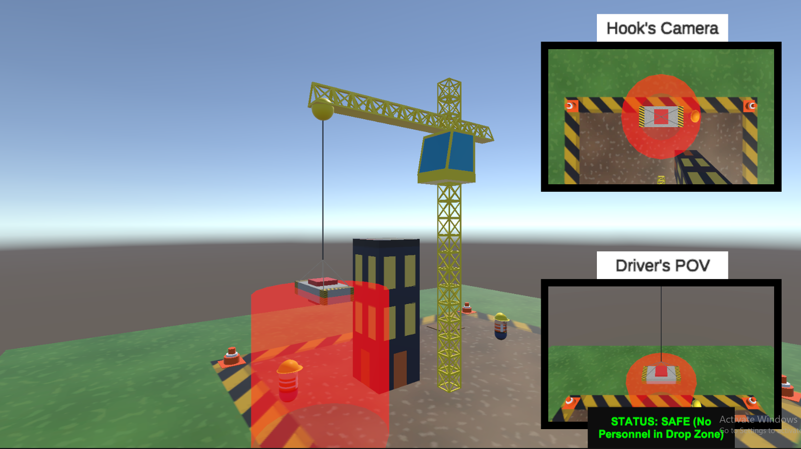
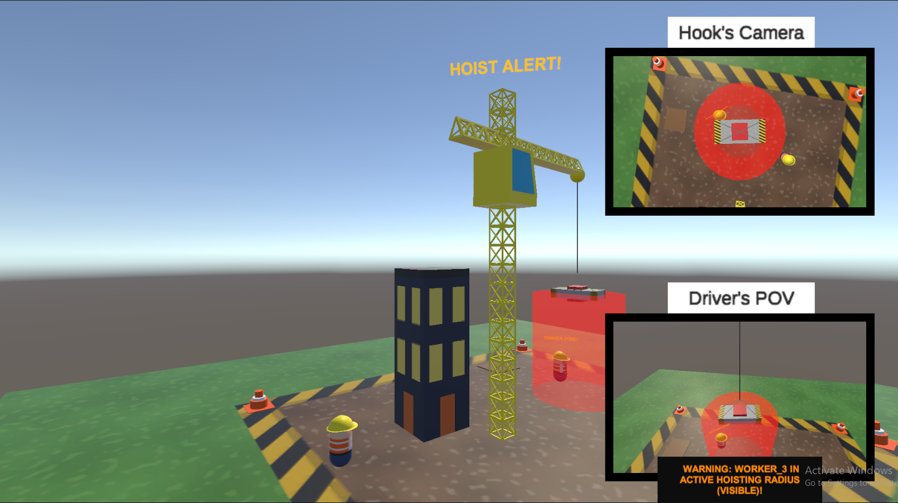
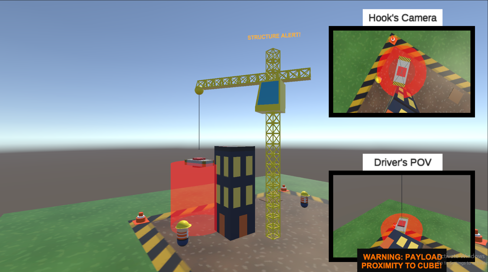
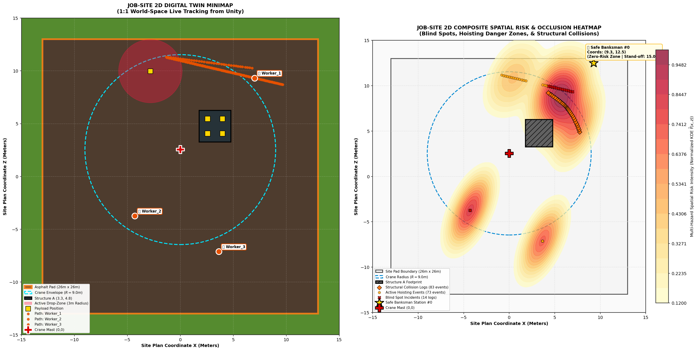
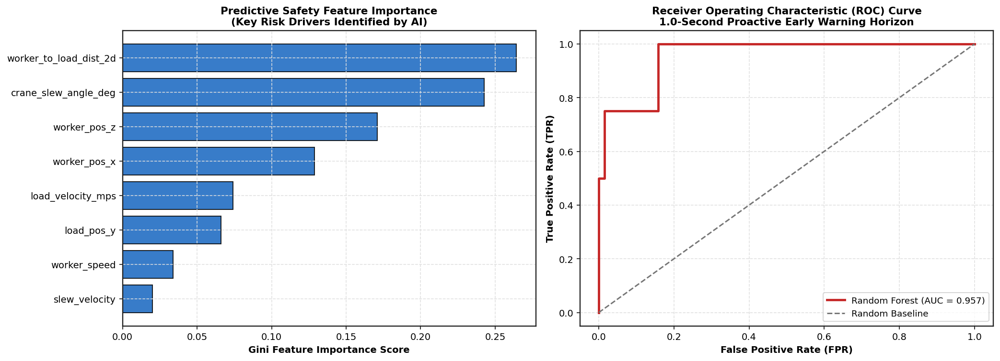
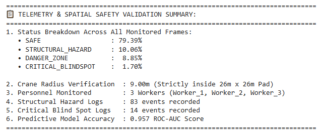

# Construction Crane Safety Digital Twin: 1:1 Spatial Telemetry & Predictive AI

An interactive 3D spatial digital twin and telemetry analytics framework developed to evaluate, visualize, and proactively forecast tower crane collision hazards and operator blind spots on high-density jobsites.

> 🎥 **[Watch the 1-Minute Demonstration Video](YOUR_YOUTUBE_OR_DRIVE_LINK)**

---

## 1. System Demonstration

### 3D Digital Twin Simulation (Unity Environment)
| Operator Cab POV & Slew Envelope | Hook-View Drop-Zone Tracking | Structural Occlusion Hazard |
| :---: | :---: | :---: |
|  |  |  |

### Telemetry Analytics & Spatial Risk Reconstruction (Python)
| 1:1 World Minimap & Dynamic KDE Risk Heatmap |
| :---: |
|  |

| Feature Importance & 1.0s Lookahead ROC Curve | Telemetry Analytics |
| :---: | :---: |
|  |  |

---

## 2. Technical Workflow

The pipeline operates in three interconnected stages:

1. **Spatial Telemetry Extraction (Unity C#):**
   * Real-time kinematic tracking of a 9.0 m radius crane operating across a 26 m × 26 m site pad.
   * Continuous raycasting from the operator cab to workers to evaluate line-of-sight obstruction caused by structural elements.
   * Synchronous 10 Hz telemetry streaming logging world coordinates $(X, Y, Z)$, velocities, and obstacle distances.

2. **Spatial Risk Density & Station Optimization (Python / SciPy):**
   * Multi-hazard spatial risk mapping using dynamic Kernel Density Estimation (KDE).
   * Automated positioning of safe ground signaller (Banksman) stations outside the 9.0 m swing radius using DBSCAN spatial clustering on historical blind-spot occurrences.

3. **Proactive Hazard Forecasting (Scikit-Learn):**
   * Supervised Random Forest classifier trained on dynamic kinematics to forecast critical blind-spot breaches 1.0 second ($\Delta t = 10\text{ frames}$) prior to entry.

---

## 3. Safety State Classification Matrix

Hazard severity is evaluated under **CSA Z248** (Code for Tower Cranes) and **OSHA 1926.1419**:

| Level | State Label | Spatial & Occlusion Criteria | HUD Alert |
| :---: | :--- | :--- | :---: |
| **0** | `SAFE` | Worker distance $> 3.0\text{ m}$; Load $> 3.0\text{ m}$ from structure | Normal HUD |
| **1** | `DANGER_ZONE` | Worker $\le 3.0\text{ m}$ under active drop zone; Unobstructed line-of-sight | Caution Amber |
| **2** | `STRUCTURAL_HAZARD` | Load trajectory $\le 3.0\text{ m}$ from building structure | Caution Amber |
| **3** | `CRITICAL_BLINDSPOT` | Worker $\le 3.0\text{ m}$ **AND** operator line-of-sight occluded | Flashing Crimson |

---

## 4. Key Results

* **Predictive Accuracy:** Achieved an **ROC-AUC of 0.957** on the 1.0-second early-warning horizon.
* **Key Risk Drivers:** Identified `worker_to_load_dist_2d` and `crane_slew_angle_deg` as the primary predictive indicators of imminent hazard breaches.
* **Telemetry Distribution:**
  * Safe Operations: **79.39%**
  * Structural Collision Warnings: **10.06%** (83 events)
  * Active Hoisting Danger Zones: **8.85%**
  * Critical Blind Spot Occlusions: **1.70%** (14 events)

---

## 5. Quick Start (Google Colab)

You can run the full telemetry analytics, spatial risk heatmaps, and ML training directly in Google Colab:

1. Click the **[Open In Colab]** badge at the top of this repository.
2. Run all cells to reproduce the exact figures and summary tables shown above.

---

## Author

**Yesaya Alvin Kriscahyadi**  
M.Sc. Candidate in Data Science | B.Eng. in Civil Engineering  
* Salatiga, Central Java, Indonesia
* **LinkedIn:** [Your LinkedIn Profile URL]
* **GitHub:** [Your GitHub Profile URL]
